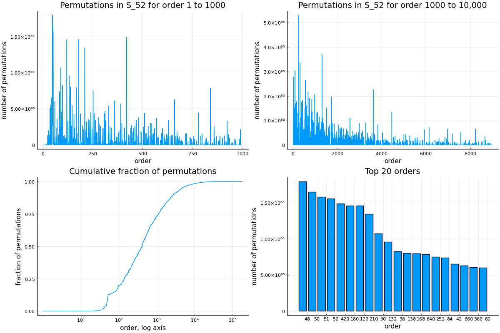

# SymmetricOrders.jl

It takes 7 "perfect" shuffles to get back to the original deck of 52 cards. If this number seems low to you (and it is!), read on! Here we explore the distribution of orders in card deck shuffles, aka the symmetric group $S_{52}$. For example, interchanging the top two cards has order 2 because doing it twice results in the original deck. Putting the top card at the bottom has order 52.

Joint with [Brian Nugent](https://math.washington.edu/people/brian-nugent).

An image is worth a thousand words.

## Answered Questions

Q: What is the maximum order of a deck shuffle?\
A: $180180$

Q: What is the average order?\
A: $1247.2$

Q: How many different orders appear in $S_{52}$?\
A: $1217$

Q: What is the most common order?\
A: $48$

Q: What fraction of deck shuffles have order 7 or lower?\
A: $1.1 \times 10^{-10}$. The "perfect" shuffle is very special!
